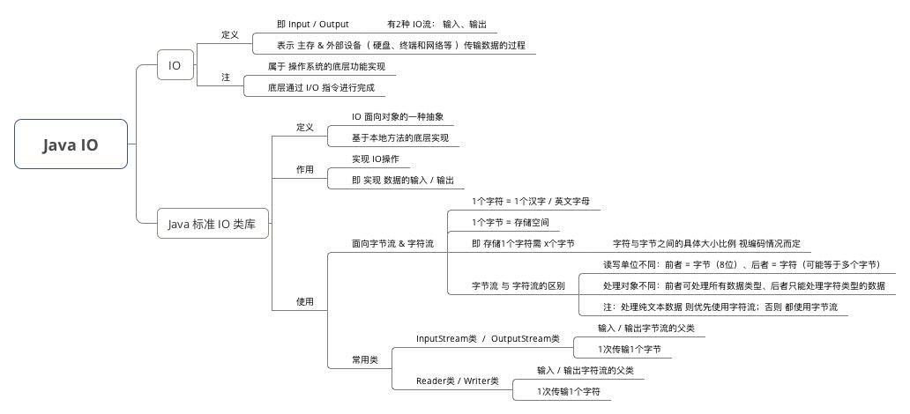
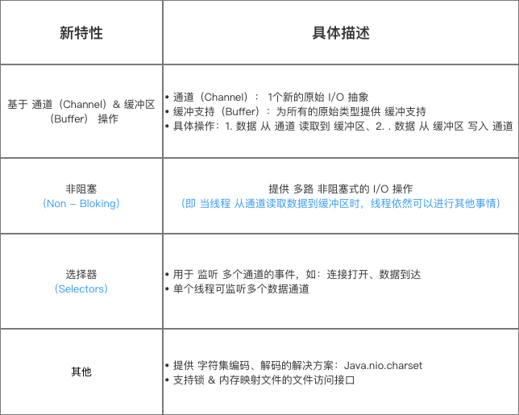

# java IO

Java 中的 BIO、NIO和 AIO 理解为是 Java 语言对操作系统的各种 IO 模型的封装。

## BIO、NIO、AIO的区别

1. BIO 就是传统的 java.io 包，它是基于流模型实现的，交互的方式是同步、阻塞方式，也就是说在读入输入流或者输出流时，在读写动作完成之前，线程会一直阻塞在那里，它们之间的调用时可靠的线性顺序。它的有点就是代码比较简单、直观；缺点就是 IO 的效率和扩展性很低，容易成为应用性能瓶颈。（同步、阻塞）
2. NIO 是 Java 1.4 引入的 java.nio 包，提供了 Channel、Selector、Buffer 等新的抽象，可以构建多路复用的、同步非阻塞 IO 程序，同时提供了更接近操作系统底层高性能的数据操作方式。（同步、非阻塞）
3. AIO 是 Java 1.7 之后引入的包，是 NIO 的升级版本，提供了异步非堵塞的 IO 操作方式，所以人们叫它 AIO（Asynchronous IO），异步 IO 是基于事件和回调机制实现的，也就是应用操作之后会直接返回，不会堵塞在那里，当后台处理完成，操作系统会通知相应的线程进行后续的操作。（异步，阻塞）

## IO的类型

- InputStream、OutputStream 基于字节操作的 IO
- Writer、Reader 基于字符操作的 IO
- File 基于磁盘操作的 IO
- Socket 基于网络操作的 IO

## Java IO



## NIO

- 即 `Java New IO`
- 是1个全新的、 `JDK 1.4`后提供的 `IO API`
- 提供了与标准`IO`不同的`IO`工作方式
- 可替代 标准`Java IO` 的`IO API`



主要组件：

**Channel ：**相当于IO中的stream，但是Channel是双向的，既可以用来进行读操作，又可以用来进行写操作。

- FileChannel：作用于IO文件流
- DatagramChannel：作用于UDP协议
- SocketChannel：作用于TCP协议
- ServerSocketChannel：作用于TCP协议

**Buffer：**缓冲区，用在线程和channel之间，来缓存数据

**Selector：** 选择器是NIO的核心，它是channel的管理者通过执行select()阻塞方法，监听是否有channel准备好，一旦有数据可读，此方法的返回值是SelectionKey的数量

NIO代码示例

服务端：

```java
package cn.blog.test.NioTest;


import java.io.IOException;
import java.net.InetSocketAddress;
import java.nio.ByteBuffer;
import java.nio.channels.*;
import java.nio.charset.Charset;
import java.util.Iterator;
import java.util.Set;


public class MyNioServer {
    private Selector selector;          //创建一个选择器
    private final static int port = 8686;
    private final static int BUF_SIZE = 10240;

    private void initServer() throws IOException {
        //创建通道管理器对象selector
        this.selector=Selector.open();

        //创建一个通道对象channel
        ServerSocketChannel channel = ServerSocketChannel.open();
        channel.configureBlocking(false);       //将通道设置为非阻塞
        channel.socket().bind(new InetSocketAddress(port));       //将通道绑定在8686端口

        //将上述的通道管理器和通道绑定，并为该通道注册OP_ACCEPT事件
        //注册事件后，当该事件到达时，selector.select()会返回（一个key），如果该事件没到达selector.select()会一直阻塞
        SelectionKey selectionKey = channel.register(selector,SelectionKey.OP_ACCEPT);

        while (true){       //轮询
            selector.select();          //这是一个阻塞方法，一直等待直到有数据可读，返回值是key的数量（可以有多个）
            Set keys = selector.selectedKeys();         //如果channel有数据了，将生成的key访入keys集合中
            Iterator iterator = keys.iterator();        //得到这个keys集合的迭代器
            while (iterator.hasNext()){             //使用迭代器遍历集合
                SelectionKey key = (SelectionKey) iterator.next();       //得到集合中的一个key实例
                iterator.remove();          //拿到当前key实例之后记得在迭代器中将这个元素删除，非常重要，否则会出错
                if (key.isAcceptable()){         //判断当前key所代表的channel是否在Acceptable状态，如果是就进行接收
                    doAccept(key);
                }else if (key.isReadable()){
                    doRead(key);
                }else if (key.isWritable() && key.isValid()){
                    doWrite(key);
                }else if (key.isConnectable()){
                    System.out.println("连接成功！");
                }
            }
        }
    }

    public void doAccept(SelectionKey key) throws IOException {
        ServerSocketChannel serverChannel = (ServerSocketChannel) key.channel();
        System.out.println("ServerSocketChannel正在循环监听");
        SocketChannel clientChannel = serverChannel.accept();
        clientChannel.configureBlocking(false);
        clientChannel.register(key.selector(),SelectionKey.OP_READ);
    }

    public void doRead(SelectionKey key) throws IOException {
        SocketChannel clientChannel = (SocketChannel) key.channel();
        ByteBuffer byteBuffer = ByteBuffer.allocate(BUF_SIZE);
        long bytesRead = clientChannel.read(byteBuffer);
        while (bytesRead>0){
            byteBuffer.flip();
            byte[] data = byteBuffer.array();
            String info = new String(data).trim();
            System.out.println("从客户端发送过来的消息是："+info);
            byteBuffer.clear();
            bytesRead = clientChannel.read(byteBuffer);
        }
        if (bytesRead==-1){
            clientChannel.close();
        }
    }

    public void doWrite(SelectionKey key) throws IOException {
        ByteBuffer byteBuffer = ByteBuffer.allocate(BUF_SIZE);
        byteBuffer.flip();
        SocketChannel clientChannel = (SocketChannel) key.channel();
        while (byteBuffer.hasRemaining()){
            clientChannel.write(byteBuffer);
        }
        byteBuffer.compact();
    }

    public static void main(String[] args) throws IOException {
        MyNioServer myNioServer = new MyNioServer();
        myNioServer.initServer();
    }
}
```

客户端代码：

```java
package cn.blog.test.NioTest;


import java.io.IOException;
import java.net.InetSocketAddress;
import java.nio.ByteBuffer;
import java.nio.channels.SelectionKey;
import java.nio.channels.Selector;
import java.nio.channels.SocketChannel;
import java.util.Iterator;

public class MyNioClient {
    private Selector selector;          //创建一个选择器
    private final static int port = 8686;
    private final static int BUF_SIZE = 10240;
    private static ByteBuffer byteBuffer = ByteBuffer.allocate(BUF_SIZE);

    private void  initClient() throws IOException {
        this.selector = Selector.open();
        SocketChannel clientChannel = SocketChannel.open();
        clientChannel.configureBlocking(false);
        clientChannel.connect(new InetSocketAddress(port));
        clientChannel.register(selector, SelectionKey.OP_CONNECT);
        while (true){
            selector.select();
            Iterator<SelectionKey> iterator = selector.selectedKeys().iterator();
            while (iterator.hasNext()){
                SelectionKey key = iterator.next();
                iterator.remove();
                if (key.isConnectable()){
                    doConnect(key);
                }else if (key.isReadable()){
                    doRead(key);
                }
            }
        }
    }

    public void doConnect(SelectionKey key) throws IOException {
        SocketChannel clientChannel = (SocketChannel) key.channel();
        if (clientChannel.isConnectionPending()){
            clientChannel.finishConnect();
        }
        clientChannel.configureBlocking(false);
        String info = "服务端你好!!";
        byteBuffer.clear();
        byteBuffer.put(info.getBytes("UTF-8"));
        byteBuffer.flip();
        clientChannel.write(byteBuffer);
        //clientChannel.register(key.selector(),SelectionKey.OP_READ);
        clientChannel.close();
    }

    public void doRead(SelectionKey key) throws IOException {
        SocketChannel clientChannel = (SocketChannel) key.channel();
        clientChannel.read(byteBuffer);
        byte[] data = byteBuffer.array();
        String msg = new String(data).trim();
        System.out.println("服务端发送消息："+msg);
        clientChannel.close();
        key.selector().close();
    }

    public static void main(String[] args) throws IOException {
        MyNioClient myNioClient = new MyNioClient();
        myNioClient.initClient();
    }
}

```

## 小结

IO 是同步阻塞的，一个线程只能处理一个链路，可以使用线程池来处理，但本质上还是同步的，当前线程只能阻塞到IO准备好为止，才能进行IO

NIO Non-blocking IO/New IO 同步非阻塞，

面向流和面向缓冲区：NIO是面向缓冲区的，将所有数据读到或者写到缓冲区再进行操作。

通道： 通道是双向的，既可以写也可以读，不需要为输入输出单独建流。

选择器：NIO通过选择器来监控多个通道的状态，这样无需为每一个单独的连接建立一个线程，可以实现单线程管理多个通道，提高系统效率。


## Steam等流的一些知识