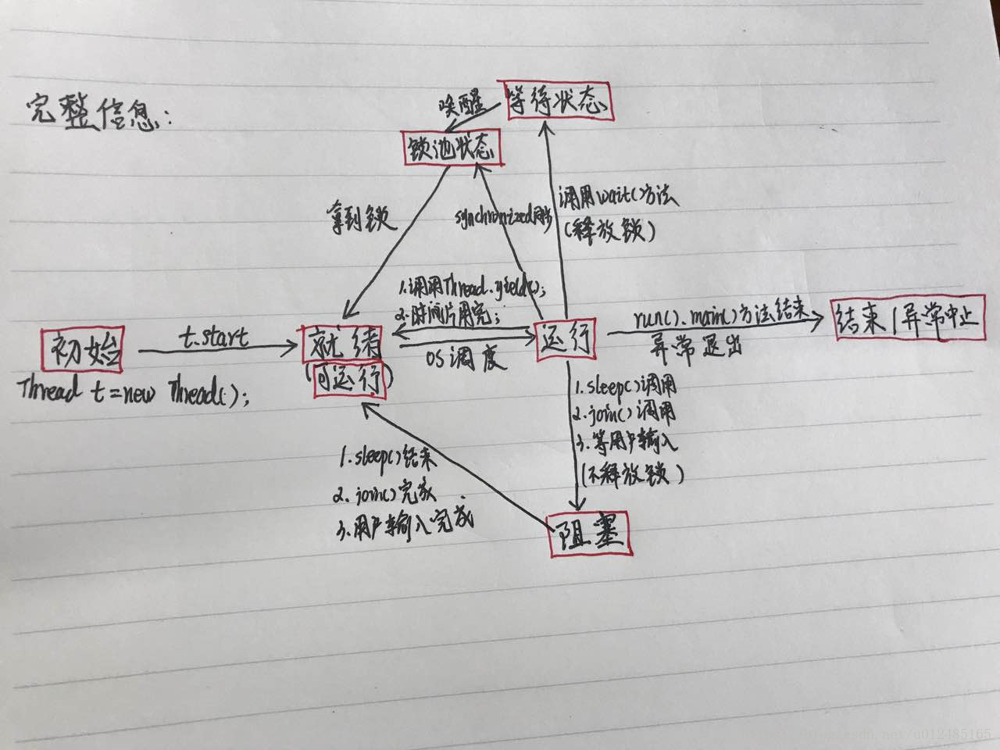

# **Java**并发

主要的问题：

1. 什么是多线程
2. 如何实现多线程
3. 多线程的问题及解决方法

## 1.什么是多线程

1. **进程与线程**：进程是资源分配的最小单位，线程是程序执行的最小单位（资源调度的最小单位）

   *一个程序至少有一个进程,一个进程至少有一个线程*。

   进程，是计算机中的程序关于某数据集合上的一次运行活动，是系统进行资源分配和调度的基本单位，是操作系统结构的基础。它的执行需要系统分配资源创建实体之后，才能进行。

   线程是进程的一个实体,是CPU调度和分派的基本单位,它是比进程更小的能独立运行的基本单位.线程自己基本上不拥有系统资源,只拥有一点在运行中必不可少的资源(如[程序计数器](https://www.baidu.com/s?wd=程序计数器&tn=SE_PcZhidaonwhc_ngpagmjz&rsv_dl=gh_pc_zhidao),一组寄存器和栈),但是它可与同属一个进程的其他的线程共享进程所拥有的全部资源.

   通俗一点说，进程就是程序的一次执行，而线程可以理解为进程中的执行的一段程序片段。

   **区别**

   1）地址空间和其它资源（如打开文件）：进程间相互独立，同一进程的各线程间共享。某进程内的线程在其它进程不可见。

   2）通信：进程间通信IPC(Inter-Process Communication)，线程间可以直接读写进程数据段（如全局变量）来进行通信——需要进程同步和互斥手段的辅助，以保证数据的一致性。

   3）调度和切换：线程上下文切换比进程上下文切换要快得多。

   4）

2. 线程的状态转换

   

### 并发程序的同步方式

进程：无名管道(pipe)、有名管道(FIFO)、信号、共享内存、消息队列、信号量、套接字(socket)
线程：互斥量、读写锁、自旋锁、线程信号、条件变量

## 2.如何实现多线程

+ 继承Thread

  ```java
  class thread extends Thread{
      String name;
      public thread(String name) {
          this.name = name;
      }
  
      public void run() {
          System.out.println(this.name);
      }
  }
  public class ThreadTest {
      public static void main(String[] args) {
          thread thread1 = new thread("1");
          thread thread2 = new thread("2");
          thread1.start();
          thread2.start();
          System.out.println("main");
      }
  }
  ```

+ 实现runnable接口

  ```java
  class thread implements Runnable{
      String name;
      public thread(String name) {
          this.name = name;
      }
  
      @Override
      public void run() {
          System.out.println(this.name);
      }
  }
  public class ThreadTest {
      public static void main(String[] args) {
          new Thread(new thread("1")).start();
          new Thread(new thread("2")).start();
          System.out.println("main");
      }
  }
  ```

  运行时区别，要将runnable对象传入一个Thread对象的构造函数内

+ 实现Callable接口和Future，FutureTask

  可以在线程执行完毕后获取返回的结果。

  Future 是线程池提交了callable任务后的返回的对象

  采用Future实现多线程：

  ```java
  import java.util.concurrent.*;
  class myCallable implements Callable<String> {
      String name;
      public myCallable(String name) {
          this.name = name;
      }
      @Override
      public String call() throws Exception {
          System.out.println(this.name);
          return this.name;
      }
  }
  public class ThreadTest {
      public static void main(String[] args) {
          //创建线程池
          ExecutorService es = Executors.newSingleThreadExecutor();
          Future<String> future1 = es.submit(new myCallable("1"));
          Future<String> future2 = es.submit(new myCallable("2"));
          try {
              Thread.sleep(1000);
              System.out.println("return future1:"+future1.get());
              System.out.println("return future2:"+future2.get());
          }catch (Exception e) {
              e.printStackTrace();
          }
          System.out.println("main");
      }
  }
  ```

  FutureTask 接口实现了RunnableFuture接口，而RunnableFuture接口继承了Runnable 和Future接口因此FutureTask也可以直接提交给Executor执行。 当然也可以调用线程直接执行（FutureTask.run()）

  采用futuretask实现多线程：

  ```java
  import java.util.concurrent.*;
  class myCallable implements Callable<String> {
      String name;
      public myCallable(String name) {
          this.name = name;
      }
  
      @Override
      public String call() throws Exception {
          System.out.println(this.name);
          return this.name;
      }
  }
  public class ThreadTest {
      public static void main(String[] args) {
          FutureTask futureTask1= new FutureTask(new myCallable("1"));
          FutureTask futureTask2= new FutureTask(new myCallable("2"));
          new Thread(futureTask1).start();
          new Thread(futureTask2).start();
          try {
              Thread.sleep(1000);
              System.out.println("1:"+futureTask1.get());
              System.out.println("2:"+futureTask2.get());
          } catch (Exception e){
              e.printStackTrace();
          }
          System.out.println("main");
      }
  }
  ```

## 3.线程间同步与线程安全

区别进程里面的 ***同步/异步 阻塞/非阻塞*** 概念：

**1.同步与异步**
同步和异步关注的是**消息通信机制** (synchronous communication/ asynchronous communication)
所谓同步，就是在发出一个*调用*时，在没有得到结果之前，该*调用*就不返回。但是一旦调用返回，就得到返回值了。
换句话说，就是由*调用者*主动等待这个*调用*的结果。

而异步则是相反，**调用在发出之后，这个调用就直接返回了，所以没有返回结果**。换句话说，当一个异步过程调用发出后，调用者不会立刻得到结果。而是在*调用*发出后，*被调用者*通过状态、通知来通知调用者，或通过回调函数处理这个调用。

**2.阻塞非阻塞**

阻塞和非阻塞关注的是**程序在等待调用结果（消息，返回值）时的状态.**

阻塞调用是指调用结果返回之前，当前线程会被挂起。调用线程只有在得到结果之后才会返回。
非阻塞调用指在不能立刻得到结果之前，该调用不会阻塞当前线程。

### Java 线程间同步

由于多个线程可能会共享相同的内存空间和资源，因此在进行多线程时，要保证多个线程合理访问资源，防止造成冲突和错误。

### 线程安全

需要线程满足执行控制和内存可见

执行控制：线程按照人为的设想进行并发和要求执行。

内存可见：线程对内存的操作和修改对其他线程是可见的。

### 线程同步方法

+ **Synchronized同步**
  
  Java语言的关键字，当它用来修饰一个方法或者一个代码块的时候，能够保证在同一时刻最多只有一个线程执行该段代码。
  
  synchronized：可见性，原子性
  
  需要注意的地方，synchronized是对象锁，对整个对象的同步代码进行加锁，未获得锁的线程，所有对同步代码块的访问的请求都被阻塞。无论该线程请求的是不是加锁的线程所访问的代码块，所有同步代码块都被加锁。
  
  普通方法：只有获取了该对象的锁的可以访问，不影响其他对象的访问。
  
  静态方法：只有获取了类的锁的线程可访问，所有对象均被block。
  
  其他未被Synchronized修饰的方法，可以直接访问。
  
  Synchronized关键字不能继承。 父类使用了 synchronized的方法，子类在继承的时候默认是不同步的
  
  在定义接口方法时不能使用synchronized关键字
  
  构造方法不能使用synchronized关键字，但可以使用synchronized代码块来进行同步。 
  
  Synchronized也可以对类进行同步控制。
  
  + 同步方法
  
  ```java
  import java.util.concurrent.*;
  
  /**
   * Description:
   * User: jehuRen
   * Date: 2019-08-26
   * Time: 14:56
   */
  class myRunnable implements Runnable{
      String name;
      public myRunnable(String name) {
          this.name = name;
      }
  
      @Override
      public void run() {
          System.out.println(this.name);
          System.out.println(Thread.currentThread().getId());
      }
  }
  public class ThreadTest {
      public static void main(String[] args) {
          Runnable runnable = new myRunnable("1");
          new Thread(runnable).start();
          new Thread(runnable).start();
          System.out.println("main");
      }
  }
  ```
  
  + 同步代码块
  
  ```java
  //synchronized 块：通过 synchronized关键字来声明synchronized 块。语法如下：  
  synchronized(syncObject) {  
  //允许访问控制的代码  
  }  
  //synchronized 块是这样一个代码块，其中的代码必须获得对象 syncObject （如前所述，可以是类实例或类）的锁方能执行
  ```
  
  synchronized实现机制：
  
  基于操作系统的mutex lock互斥锁来实现的，是重量级锁，后面会详细介绍
  
+ **使用volatile进行同步**

  1. volatile关键字为域变量的访问提供了一种免锁机制， 
  2. 使用volatile修饰域相当于告诉虚拟机该域可能会被其他线程更新， 
  3. 因此每次使用该域就要重新加载，而不是使用寄存器中的值，每次修改完之后要重新写入主内存 
  4. volatile不会提供任何原子操作，它也不能用来修饰final类型的变量，volatile只提供可见性，不提供原子性 
  5. volatile 可以禁止指令重排序，不缓存在cache中

  ```java
  public class Counter { 
  
   public volatile static int count = 0; 
  
       public static void inc() { 
           //这里延迟1毫秒，使得结果明显 
           try { 
               Thread.sleep(1); 
           } catch (InterruptedException e) {
           }
           count++; 
       } 
  
      public static void main(String[] args) { 
  
          //同时启动1000个线程，去进行i++计算，看看实际结果 
          for (int i = 0; i < 1000; i++) { 
              new Thread(new Runnable() { 
                  @Override
                  public void run() { 
                      Counter.inc(); 
                  } 
              }).start(); 
          } 
       
          //这里每次运行的值都有可能不同,可能为1000 
          System.out.println("运行结果:Counter.count=" + Counter.count); 
      } 
  }
  ```

  ### CAS

  CAS(Compare And Swap)，即比较并交换。是解决多线程并行情况下使用锁造成性能损耗的一种机制，CAS操作包含三个操作数——内存位置（V）、预期原值（A）和新值(B)。如果内存位置的值与预期原值相匹配，那么处理器会自动将该位置值更新为新值。否则，处理器不做任何操作。

  java采用 sun.misc.unsafe类里的CAS实现的，unsafe的实现是基于操作系统实现的。java.util.concurrent.atomic里面的原子类和AQS是采用CSA操作实现的。

+ **锁实现线程同步**

  在JavaSE5.0中新增了一个java.util.concurrent包来支持同步。 ReentrantLock类是可重入、互斥、实现了Lock接口的锁， 它与使用synchronized方法和快具有相同的基本行为和语义，并且扩展了其能力。

  主要有：ReentrantLock可重入独占锁，ReentrantReadWriteLock读写锁（读共享，写独占），CountDownLatch（计数器），CyclicBarrier（回环栅栏），samaphore（信号量）

  ***可重入锁实例***

  ```java
  public class ReentrantLockDemo01 implements Runnable {
  
      private Lock lock = new ReentrantLock();
  
      private int tickets = 200;
  
      @Override
      public void run() {
          while (true) {
              lock.lock(); // 获取锁
              try {
                  if (tickets > 0) {
                      TimeUnit.MILLISECONDS.sleep(100);
                      System.out.println(Thread.currentThread().getName() + " " + tickets--);
                  } else {
                      break;
                  }
              } catch (InterruptedException e) {
                  e.printStackTrace();
              } finally {
                  lock.unlock(); // 释放所
              }
          }
      }
  
      public static void main(String[] args) {
          ReentrantLockDemo01 reentrantLockDemo = new ReentrantLockDemo01();
          for (int i = 0; i < 10; i++) {
              Thread thread = new Thread(reentrantLockDemo, "thread" + i);
              thread.start();
          }
      }
  }
  ```

  ***读写锁使用实例***

  ```java
  import java.util.concurrent.locks.Lock;
  import java.util.concurrent.locks.ReentrantLock;
  import java.util.concurrent.locks.ReentrantReadWriteLock;
  
  public class JUCtest {
      private ReentrantReadWriteLock reentrantReadWriteLock = new ReentrantReadWriteLock();
      private Lock RWlock = new ReentrantLock();
      private int tickets = 200;
  
      public void read(){
          reentrantReadWriteLock.readLock().lock();
          try {
              System.out.println(Thread.currentThread().getName()+":"+tickets);
          } finally {
              reentrantReadWriteLock.readLock().unlock();
          }
      }
      public void write(){
          reentrantReadWriteLock.writeLock().lock();
          try {
              System.out.println(Thread.currentThread().getName()+":"+tickets--);
          } finally {
              reentrantReadWriteLock.writeLock().unlock();
          }
      }
  
      public static void main(String[] args) {
          JUCtest juCtest = new JUCtest();
          for (int i = 0; i < 10; i++) {
              Thread thread = new Thread(new Runnable() {
                  @Override
                  public void run() {
                      juCtest.write();
                  }
              }, "thread" + i);
              thread.start();
          }
          for (int i = 0; i < 10; i++) {
              Thread thread = new Thread(new Runnable() {
                  @Override
                  public void run() {
                      juCtest.read();
                  }
              },"thread"+i*10);
              thread.start();
          }
      }
  }
  ```

  **CountDownLatch**

  新建对象时设置计数的值

  调用await()方法当前线程会挂起，等待count值减为0时继续。

  调用countDown()方法可以将计数值减一

  ```java
  public class Test {
       public static void main(String[] args) {   
           final CountDownLatch latch = new CountDownLatch(2);
            
           new Thread(){
               public void run() {
                   try {
                       System.out.println("子线程"+Thread.currentThread().getName()+"正在执行");
                      Thread.sleep(3000);
                      System.out.println("子线程"+Thread.currentThread().getName()+"执行完毕");
                      latch.countDown();
                  } catch (InterruptedException e) {
                      e.printStackTrace();
                  }
               };
           }.start();
            
           new Thread(){
               public void run() {
                   try {
                       System.out.println("子线程"+Thread.currentThread().getName()+"正在执行");
                       Thread.sleep(3000);
                       System.out.println("子线程"+Thread.currentThread().getName()+"执行完毕");
                       latch.countDown();
                  } catch (InterruptedException e) {
                      e.printStackTrace();
                  }
               };
           }.start();
            
           try {
               System.out.println("等待2个子线程执行完毕...");
              latch.await();
              System.out.println("2个子线程已经执行完毕");
              System.out.println("继续执行主线程");
          } catch (InterruptedException e) {
              e.printStackTrace();
          }
       }
  }
  ```

  **CyclicBarrier**

  字面意思回环栅栏，通过它可以实现让一组线程等待至某个状态之后再全部同时执行。叫做回环是因为当所有等待线程都被释放以后，CyclicBarrier可以被重用。我们暂且把这个状态就叫做barrier，当调用await()方法之后，线程就处于barrier了。

  ```java
  public class Test {
      public static void main(String[] args) {
          int N = 4;
          CyclicBarrier barrier  = new CyclicBarrier(N,new Runnable() {
              @Override
              public void run() {
                  System.out.println("当前线程"+Thread.currentThread().getName());   
              }
          });
           
          for(int i=0;i<N;i++)
              new Writer(barrier).start();
      }
      static class Writer extends Thread{
          private CyclicBarrier cyclicBarrier;
          public Writer(CyclicBarrier cyclicBarrier) {
              this.cyclicBarrier = cyclicBarrier;
          }
   
          @Override
          public void run() {
              System.out.println("线程"+Thread.currentThread().getName()+"正在写入数据...");
              try {
                  Thread.sleep(5000);      //以睡眠来模拟写入数据操作
                  System.out.println("线程"+Thread.currentThread().getName()+"写入数据完毕，等待其他线程写入完毕");
                  cyclicBarrier.await();
              } catch (InterruptedException e) {
                  e.printStackTrace();
              }catch(BrokenBarrierException e){
                  e.printStackTrace();
              }
              System.out.println("所有线程写入完毕，继续处理其他任务...");
          }
      }
  }
  ```

  **semaphore**

  Semaphore翻译成字面意思为 信号量，Semaphore可以控同时访问的线程个数，通过 acquire() 获取一个许可，如果没有就等待，而 release() 释放一个许可。可以看成一个互斥锁。

  ```java
  public class Test {
      public static void main(String[] args) {
          int N = 8;            //工人数
          Semaphore semaphore = new Semaphore(5); //机器数目
          for(int i=0;i<N;i++)
              new Worker(i,semaphore).start();
      }
       
      static class Worker extends Thread{
          private int num;
          private Semaphore semaphore;
          public Worker(int num,Semaphore semaphore){
              this.num = num;
              this.semaphore = semaphore;
          }
           
          @Override
          public void run() {
              try {
                  semaphore.acquire();
                  System.out.println("工人"+this.num+"占用一个机器在生产...");
                  Thread.sleep(2000);
                  System.out.println("工人"+this.num+"释放出机器");
                  semaphore.release();           
              } catch (InterruptedException e) {
                  e.printStackTrace();
              }
          }
      }
  }
  ```

+ **使用局部变量实现线程同步**

  同步机制是为了同步多个线程对相同资源的并发访问，是为了多个线程之间进行通信的有效方式；而ThreadLocal是隔离多个线程的数据共享，从根本上就不在多个线程之间共享变量，这样当然不需要对多个线程进行同步了。

  ```java
  //只改Bank类，其余代码与上同
  public class Bank{
      //使用ThreadLocal类管理共享变量account
      private static ThreadLocal<Integer> account = new ThreadLocal<Integer>(){
          @Override
          protected Integer initialValue(){
              return 100;
          }
      };
      public void save(int money){
          account.set(account.get()+money);
      }
      public int getAccount(){
          return account.get();
      }
  }
  ```

+ **使用阻塞队列实现线程同步**

+ 前面5种同步方式都是在底层实现的线程同步，但是我们在实际开发当中，应当尽量远离底层结构。 使用javaSE5.0版本中新增的java.util.concurrent包将有助于简化开发。 本小节主要是使用**LinkedBlockingQueue<E>**来实现线程的同步 

  **LinkedBlockingQueue 类常用方法** 
  LinkedBlockingQueue() : 创建一个容量为Integer.MAX_VALUE的LinkedBlockingQueue 

  ​    put(E e) : 在队尾添加一个元素，如果队列满则阻塞 
  ​    size() : 返回队列中的元素个数 
  ​    take() : 移除并返回队头元素，如果队列空则阻塞 

  ```java
  package com.xhj.thread;
  
  import java.util.Random;
  import java.util.concurrent.LinkedBlockingQueue;
  
  /**
   * 用阻塞队列实现线程同步 LinkedBlockingQueue的使用
   * 
   * @author XIEHEJUN
   * 
   */
  public class BlockingSynchronizedThread {
      /**
       * 定义一个阻塞队列用来存储生产出来的商品
       */
      private LinkedBlockingQueue<Integer> queue = new LinkedBlockingQueue<Integer>();
      /**
       * 定义生产商品个数
       */
      private static final int size = 10;
      /**
       * 定义启动线程的标志，为0时，启动生产商品的线程；为1时，启动消费商品的线程
       */
      private int flag = 0;
  
      private class LinkBlockThread implements Runnable {
          @Override
          public void run() {
              int new_flag = flag++;
              System.out.println("启动线程 " + new_flag);
              if (new_flag == 0) {
                  for (int i = 0; i < size; i++) {
                      int b = new Random().nextInt(255);
                      System.out.println("生产商品：" + b + "号");
                      try {
                          queue.put(b);
                      } catch (InterruptedException e) {
                          // TODO Auto-generated catch block
                          e.printStackTrace();
                      }
                      System.out.println("仓库中还有商品：" + queue.size() + "个");
                      try {
                          Thread.sleep(100);
                      } catch (InterruptedException e) {
                          // TODO Auto-generated catch block
                          e.printStackTrace();
                      }
                  }
              } else {
                  for (int i = 0; i < size / 2; i++) {
                      try {
                          int n = queue.take();
                          System.out.println("消费者买去了" + n + "号商品");
                      } catch (InterruptedException e) {
                          // TODO Auto-generated catch block
                          e.printStackTrace();
                      }
                      System.out.println("仓库中还有商品：" + queue.size() + "个");
                      try {
                          Thread.sleep(100);
                      } catch (Exception e) {
                          // TODO: handle exception
                      }
                  }
              }
          }
      }
  
      public static void main(String[] args) {
          BlockingSynchronizedThread bst = new BlockingSynchronizedThread();
          LinkBlockThread lbt = bst.new LinkBlockThread();
          Thread thread1 = new Thread(lbt);
          Thread thread2 = new Thread(lbt);
          thread1.start();
          thread2.start();
      }
  }
  ```

+ **使用原子变量实现线程同步**

  ```java
  class Bank {
      private AtomicInteger account = new AtomicInteger(100);
  
      public AtomicInteger getAccount() {
          return account;
      }
  
      public void save(int money) {
          account.addAndGet(money);
      }
  }
  ```

### 无锁，偏向锁，轻量级锁，重量级锁（synchronized优化）

**java 对象头内容**

32位JVM对象头:Mark Word（标记字段）、Klass Pointer（类型指针）


**Mark Word**：默认存储对象的HashCode，分代年龄和锁标志位信息。这些信息都是与对象自身定义无关的数据，所以Mark Word被设计成一个非固定的数据结构以便在极小的空间内存存储尽量多的数据。它会根据对象的状态复用自己的存储空间，也就是说在运行期间Mark Word里存储的数据会随着锁标志位的变化而变化。

**Klass Point**：对象指向它的类元数据的指针，虚拟机通过这个指针来确定这个对象是哪个类的实例。

**Monitor(监视器)**

Monitor record是线程私有的数据结构，每一个线程都有一个可用monitor record列表，同时还有一个全局的可用列表。每一个被锁住的对象都会和一个monitor关联，同时monitor中有一个Owner字段存放拥有该锁的线程的唯一标识，表示该锁被这个线程占用。

### 乐观锁和悲观锁

先说概念。对于同一个数据的并发操作，悲观锁认为自己在使用数据的时候一定有别的线程来修改数据，因此在获取数据的时候会先加锁，确保数据不会被别的线程修改。Java中，synchronized关键字和Lock的实现类都是悲观锁。

而乐观锁认为自己在使用数据时不会有别的线程修改数据，所以不会添加锁，只是在更新数据的时候去判断之前有没有别的线程更新了这个数据。如果这个数据没有被更新，当前线程将自己修改的数据成功写入。如果数据已经被其他线程更新，则根据不同的实现方式执行不同的操作（例如报错或者自动重试）。

乐观锁在Java中是通过使用无锁编程来实现，最常采用的是CAS算法，Java原子类中的递增操作就通过CAS自旋实现的。

### 锁的区分（按照某一方面的特性）

+ **公平锁和非公平锁**

  公平锁是指多个线程按照申请锁的顺序来获取锁，线程直接进入队列中排队，队列中的第一个线程才能获得锁。公平锁的优点是等待锁的线程不会饿死。缺点是整体吞吐效率相对非公平锁要低，等待队列中除第一个线程以外的所有线程都会阻塞，CPU唤醒阻塞线程的开销比非公平锁大。

  非公平锁是多个线程加锁时直接尝试获取锁，获取不到才会到等待队列的队尾等待。但如果此时锁刚好可用，那么这个线程可以无需阻塞直接获取到锁，所以非公平锁有可能出现后申请锁的线程先获取锁的场景。非公平锁的优点是可以减少唤起线程的开销，整体的吞吐效率高，因为线程有几率不阻塞直接获得锁，CPU不必唤醒所有线程。缺点是处于等待队列中的线程可能会饿死，或者等很久才会获得锁。

+ **自旋锁和非自旋锁**

  在许多场景中，同步资源的锁定时间很短，为了这一小段时间去切换线程，线程挂起和恢复现场的花费可能会让系统得不偿失。如果物理机器有多个处理器，能够让两个或以上的线程同时并行执行，我们就可以让后面那个请求锁的线程不放弃CPU的执行时间，看看持有锁的线程是否很快就会释放锁。

  而为了让当前线程“稍等一下”，我们需让当前线程进行自旋，如果在自旋完成后前面锁定同步资源的线程已经释放了锁，那么当前线程就可以不必阻塞而是直接获取同步资源，从而避免切换线程的开销。这就是自旋锁。自旋锁的实现原理同样也是CAS。

  自适应意味着自旋的时间（次数）不再固定，而是由前一次在同一个锁上的自旋时间及锁的拥有者的状态来决定。如果在同一个锁对象上，自旋等待刚刚成功获得过锁，并且持有锁的线程正在运行中，那么虚拟机就会认为这次自旋也是很有可能再次成功，进而它将允许自旋等待持续相对更长的时间。如果对于某个锁，自旋很少成功获得过，那在以后尝试获取这个锁时将可能省略掉自旋过程，直接阻塞线程，避免浪费处理器资源。

+ **共享锁和排他锁**

  独享锁和共享锁同样是一种概念。我们先介绍一下具体的概念，然后通过ReentrantLock和ReentrantReadWriteLock的源码来介绍独享锁和共享锁。

  独享锁也叫排他锁，是指该锁一次只能被一个线程所持有。如果线程T对数据A加上排它锁后，则其他线程不能再对A加任何类型的锁。获得排它锁的线程即能读数据又能修改数据。JDK中的synchronized和JUC中Lock的实现类就是互斥锁。

  共享锁是指该锁可被多个线程所持有。如果线程T对数据A加上共享锁后，则其他线程只能对A再加共享锁，不能加排它锁。获得共享锁的线程只能读数据，不能修改数据。

  独享锁与共享锁也是通过AQS来实现的，通过实现不同的方法，来实现独享或者共享。

### AQS

AbstractQueuedSynchronizer(AQS)，抽象的队列式的同步器，AQS定义了一套多线程访问共享资源的同步器框架，许多同步类实现都依赖于它。

AQS是一个抽象类，一些锁的实现依赖于内部类Sync，Sync继承AQS（AbstractQueuedSynchronizer），添加锁和释放锁的大部分操作实际上都是在Sync中实现的。它有公平锁FairSync和非公平锁NonfairSync两个子类。

AQS维护了一个volatile int state（代表共享资源）和一个FIFO线程等待队列（多线程争用资源被阻塞时会进入此队列）

AQS的实现依赖内部的同步队列（FIFO双向队列），如果当前线程获取同步状态失败，AQS会将该线程以及等待状态等信息构造成一个Node，将其加入同步队列的尾部，同时阻塞当前线程，当同步状态释放时，唤醒队列的头节点。
首先来看AQS最主要的三个成员变量：

```java
    private transient volatile Node head;//头结点
    
    private transient volatile Node tail;//尾结点

    private volatile int state;//同步状态变量
```

假设state=0表示同步状态可用（如果用于锁，则表示锁可用），state=1表示同步状态已被占用（锁被占用）

**获取同步状态**

假设线程A要获取同步状态（这里想象成锁，方便理解），初始状态下state=0,所以线程A可以顺利获取锁，A获取锁后将state置为1。在A没有释放锁期间，线程B也来获取锁，此时因为state=1，表示锁被占用，所以将B的线程信息和等待状态等信息构成出一个Node节点对象，放入同步队列，head和tail分别指向队列的头部和尾部**（此时队列中有一个空的Node节点作为头点，head指向这个空节点，空Node的后继节点是B对应的Node节点，tail指向它）**，同时阻塞线程B(这里的阻塞使用的是LockSupport.park()方法)。后续如果再有线程要获取锁，都会加入队列尾部并阻塞。

**释放同步状态**

当线程A释放锁时，即将state置为0，此时A会唤醒头节点的后继节点（所谓唤醒，其实是调用LockSupport.unpark(B)方法），即B线程从LockSupport.park()方法返回，此时B发现state已经为0，所以B线程可以顺利获取锁，B获取锁后B的Node节点随之出队。

(注 LockSupport 实际调用的是unsafe的park和unpark方法)

主要方法：

```java
getState()//获取状态
setState()//设置状态
compareAndSetState()//比较并设置状态，CAS
boolean tryAcquire(int arg)//尝试获取互斥锁
boolean tryRelease(int arg)//尝试释放互斥锁
int tryAcquireShared(int arg)//尝试获取共享锁
boolean tryReleaseShared(int arg)//尝试释放共享锁
boolean isHeldExclusively()//判断是否独占
```

AQS主要使用了模板模式，使用时只要实现模板中的方法即可，自定义同步器在实现时只需要实现共享资源 state 的获取与释放方式即可，至于具体线程等待队列的维护（如获取资源失败入队/唤醒出队等），AQS已经在顶层实现好了。

## 4.原子类

**基本类型**

使用原子的方式更新基本类型

- AtomicInteger：整形原子类
- AtomicLong：长整型原子类
- AtomicBoolean：布尔型原子类

**数组类型**

使用原子的方式更新数组里的某个元素

- AtomicIntegerArray：整形数组原子类
- AtomicLongArray：长整形数组原子类
- AtomicReferenceArray：引用类型数组原子类

**引用类型**

- AtomicReference：引用类型原子类
- AtomicStampedReference：原子更新引用类型里的字段原子类
- AtomicMarkableReference ：原子更新带有标记位的引用类型

**对象的属性修改类型**

- AtomicIntegerFieldUpdater：原子更新整形字段的更新器
- AtomicLongFieldUpdater：原子更新长整形字段的更新器
- AtomicStampedReference：原子更新带有版本号的引用类型。该类将整数值与引用关联起来，可用于解决原子的更新数据和数据的版本号，可以解决使用 CAS 进行原子更新时可能出现的 ABA 问题。

## 5.ThreadLocal

通常情况下，我们创建的变量是可以被任何一个线程访问并修改的。**如果想实现每一个线程都有自己的专属本地变量该如何解决呢？** JDK中提供的`ThreadLocal`类正是为了解决这样的问题。 **ThreadLocal类主要解决的就是让每个线程绑定自己的值，可以将ThreadLocal类形象的比喻成存放数据的盒子，盒子中可以存储每个线程的私有数据。**

**如果你创建了一个ThreadLocal变量，那么访问这个变量的每个线程都会有这个变量的本地副本，这也是ThreadLocal变量名的由来。他们可以使用 get（） 和 set（） 方法来获取默认值或将其值更改为当前线程所存的副本的值，从而避免了线程安全问题。**

`Thread` 类中有一个 `threadLocals` 和 一个 `inheritableThreadLocals` 变量，它们都是 `ThreadLocalMap` 类型的变量,我们可以把 `ThreadLocalMap` 理解为`ThreadLocal` 类实现的定制化的 `HashMap`。默认情况下这两个变量都是null，只有当前线程调用 `ThreadLocal` 类的 `set`或`get`方法时才创建它们，实际上调用这两个方法的时候，我们调用的是`ThreadLocalMap`类对应的 `get()`、`set() `方法。

`ThreadLocalMap` 中使用的 key 为 `ThreadLocal` 的弱引用,而 value 是强引用。所以，如果 `ThreadLocal` 没有被外部强引用的情况下，在垃圾回收的时候会 key 会被清理掉，而 value 不会被清理掉。这样一来，`ThreadLocalMap` 中就会出现key为null的Entry。假如我们不做任何措施的话，value 永远无法被GC 回收，这个时候就可能会产生内存泄露。ThreadLocalMap实现中已经考虑了这种情况，在调用 `set()`、`get()`、`remove()` 方法的时候，会清理掉 key 为 null 的记录。使用完 `ThreadLocal`方法后 最好手动调用`remove()`方法

强弱引用问题，在GC里面详细介绍。

## 6.并发容器

- **ConcurrentHashMap:** 线程安全的HashMap
- **CopyOnWriteArrayList:** 线程安全的List，在读多写少的场合性能非常好，远远好于Vector.
- **ConcurrentLinkedQueue:** 高效的并发队列，使用链表实现。可以看做一个线程安全的 LinkedList，这是一个非阻塞队列。
- **BlockingQueue:** 这是一个接口，JDK内部通过链表、数组等方式实现了这个接口。表示阻塞队列，非常适合用于作为数据共享的通道。
- **ConcurrentSkipListMap:** 跳表的实现。这是一个Map，使用跳表的数据结构进行快速查找。

## 7.线程池

线程池提供了一种限制和管理资源（包括执行一个任务）。 每个线程池还维护一些基本统计信息，例如已完成任务的数量。

**好处：**

- **降低资源消耗。** 通过重复利用已创建的线程降低线程创建和销毁造成的消耗。
- **提高响应速度。** 当任务到达时，任务可以不需要的等到线程创建就能立即执行。
- **提高线程的可管理性。** 线程是稀缺资源，如果无限制的创建，不仅会消耗系统资源，还会降低系统的稳定性，使用线程池可以进行统一的分配，调优和监控。

**线程池创建方式**

直接创建ThreadPoolExcutor对象

使用**Executors**工具类创建对应的线程池

线程池主要的参数：

- **corePoolSize：**核心池的大小，这个参数与后面讲述的线程池的实现原理有非常大的关系。
- **maximumPoolSize：**线程池最大线程数，它表示在线程池中最多能创建多少个线程；
- **keepAliveTime**：表示线程没有任务执行时最多保持多久时间会终止。
- **unit：**参数keepAliveTime的时间单位，有7种取值。
- **workQueue**：一个阻塞队列，用来存储等待执行的任务，可选择类型，影响性能
  - ArrayBlockingQueue;基于数组的先进先出队列，有界
  - LinkedBlockingQueue;基于链表的先进先出队列，无界
  - SynchronousQueue;无缓冲的等待队列，无界
- **threadFactory**：线程工厂，主要用来创建线程；
- **handler**：表示当拒绝处理任务时的策略，有以下四种取值：

```java
ThreadPoolExecutor.AbortPolicy;//丢弃任务并抛出RejectedExecutionException异常。 （默认）
ThreadPoolExecutor.DiscardPolicy;//也是丢弃任务，但是不抛出异常。 
ThreadPoolExecutor.DiscardOldestPolicy;//丢弃队列最前面的任务，然后重新尝试执行任务（重复此过程）
ThreadPoolExecutor.CallerRunsPolicy;//由调用线程处理该任务 
```

**主要的线程池类型：**

- **FixedThreadPool** ： 该方法返回一个固定线程数量的线程池。该线程池中的线程数量始终不变。当有一个新的任务提交时，线程池中若有空闲线程，则立即执行。若没有，则新的任务会被暂存在一个任务队列中，待有线程空闲时，便处理在任务队列中的任务。（固定大小）

- **SingleThreadExecutor：** 方法返回一个只有一个线程的线程池。若多余一个任务被提交到该线程池，任务会被保存在一个任务队列中，待线程空闲，按先入先出的顺序执行队列中的任务。（单个）

- **CachedThreadPool：** 该方法返回一个可根据实际情况调整线程数量的线程池。线程池的线程数量不确定，但若有空闲线程可以复用，则会优先使用可复用的线程。若所有线程均在工作，又有新的任务提交，则会创建新的线程处理任务。所有线程在当前任务执行完毕后，将返回线程池进行复用。（动态调整）

  

三种线程池  四种拒绝策略 三种等待队列