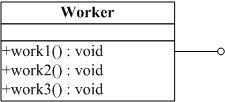
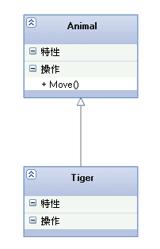
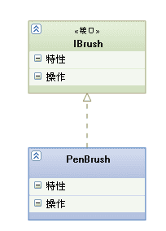
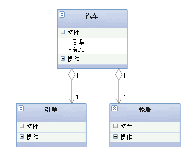
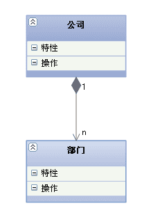
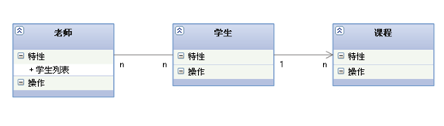
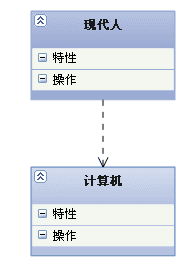

# UML类图

### UML类图的元素

#### 1.类

类包括：类的属性和类的方法（抽象方法用斜体表示）

还有作用域 + public -private # protected

#### 2.接口

接口是特殊的类，只可以被实现，不可以被实例化。

#### 3.类之间的关系

##### **实线三角指向父类**（泛化）

代码实现:子类继承父类

##### **虚线三角指向接口**（实现）

代码实现：接口实现

##### **空心菱形能分离而独立存在(聚合)**

代码实现：成员变量，个体可以独立于整体存在，菱形在整体对象一侧。

##### **实心菱形精密关联不可分，组合**

代码实现：成员变量，个体依赖于整体存在，菱形在整体侧。

****

##### **实线箭头指向关联**

代码实现：成员变量，可以有多对多和一对一，一对多的关系，是一个类可以拥有另一个类的方法和特性

##### **虚线箭头指向依赖**

代码实现：一个类使用另一个类作为局部变量，方法的参数或者调用的

箭头指向被调用的对象

聚合和组合的联系与区别：

都是关联关系，都可以表示整体与部分的关系，而聚合的部分对象是可以独立于整体存在的，组合的部分对象是无法独立于对象存在的，只有组成了整体，部分才有意义。