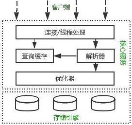

# 数据库相关知识

## mysql架构和简单流程

### 基本架构



客户端：负责连接处理，认证等功能

核心服务：负责 查询解析，优化，缓存，一些内置函数，还有存储过程，触发器，视图等。

存储引擎：负责数据的存储，更新和检索，表的创建。

## 数据库语言

DDL,DML,DQL,DCL

数据定义语言（Data Definition Language，DDL）

数据操作语言（Data Manipulation Language，DML）

数据查询语言（Data Query Language，DQL）

数据控制语言（Data Control Language，DCL）

## 存储引擎

5.5之前默认MyISAM，之后默认InnoDB

InnoDB：事务，行锁，外键约束，灾难恢复。MVCC（高并发事务）

MyISAM: 会保存数据的行数。

两种引擎的适用场景：

MyISAM 适合查询非常频繁的，不需要事务

InnoDB 社和更新插入频繁，需要可靠性，事务要求。

## ACID的实现

事务的 ACID 是通过 InnoDB 日志和锁来保证。事务的隔离性是通过数据库锁的机制实现的，持久性通过 Redo Log（重做日志）来实现，原子性和一致性通过 Undo Log 来实现。

Undo Log 的原理很简单，为了满足事务的原子性，在操作任何数据之前，首先将数据备份到一个地方（这个存储数据备份的地方称为 Undo Log）。然后进行数据的修改。

如果出现了错误或者用户执行了 Rollback 语句，系统可以利用 Undo Log 中的备份将数据恢复到事务开始之前的状态。

和 Undo Log 相反，Redo Log 记录的是新数据的备份。在事务提交前，只要将 Redo Log 持久化即可，不需要将数据持久化。

当系统崩溃时，虽然数据没有持久化，但是 Redo Log 已经持久化。系统可以根据 Redo Log 的内容，将所有数据恢复到***的状态。对具体实现过程有兴趣的同学可以去自行搜索扩展。

## MVCC

(全称)多版本并发控制

乐观锁的一种实现方式，广泛应用于数据库技术中，不仅mysql，PostgreSQL等也有该技术。

MVCC的实现，通过保存数据在某个时间点的快照来实现的。这意味着一个事务无论运行多长时间，在同一个事务里能够看到数据一致的视图。根据事务开始的时间不同，同时也意味着在同一个时刻不同事务看到的相同表里的数据可能是不同的。

用与实现读已提交和可重复度两个隔离级别

#### InnoDB实现原理

对于使用`InnoDB`存储引擎的表来说，它的聚簇索引记录中都包含两个必要的隐藏列（`row_id`并不是必要的，我们创建的表中有主键或者非NULL唯一键时都不会包含`row_id`列）：

- `trx_id`：每次对某条聚簇索引记录进行改动时，都会把对应的事务id赋值给`trx_id`隐藏列。
- `roll_pointer`：每次对某条聚簇索引记录进行改动时，都会把旧的版本写入到`undo日志`中，然后这个隐藏列就相当于一个指针，可以通过它来找到该记录修改前的信息。

每次对记录进行改动，都会记录一条`undo日志`，每条`undo日志`也都有一个`roll_pointer`属性（`INSERT`操作对应的`undo日志`没有该属性，因为该记录并没有更早的版本），可以将这些`undo日志`都连起来，串成一个链表。

#### ReadView

作用：判断版本链中的哪个版本是当前事务可见的。

数据库会维护一个当前活跃的事务的列表（未提交）

## 事务四大特性
```
原子性，要么执行，要么不执行,要么执行成功 要么全部回滚
    
隔离性，所有操作全部执行完以前其它会话不能看到过程，保证并发时的数据修改正确

一致性，事务前后，数据总额一致，事务前后的意义一致，数据合法性检查

持久性，一旦事务提交，对数据的改变就是永久的，持久化功能。
```

可能发生的问题：

```
更新丢失：两个事务都对一个数据进行修改，T1先修改，T2覆盖了T1的修改，造成更新丢失。
脏读：事务B读取事务A还没有提交的数据
不可重复读：一次事务内两次读取同一个数据不一致
幻读:事务A修改了数据，事务B也修改了数据，这时在事务A看来，明明修改了数据，咋不一样
//注：不可重复读偏向的是修改，而幻读侧重的是插入操作
```

事务的隔离级别：

```
（从高到低）
Serializable (串行化)：可避免脏读、不可重复读、幻读的发生。
Repeatable read (可重复读)：可避免脏读、不可重复读的发生。
Read committed (读已提交)：可避免脏读的发生。
Read uncommitted (读未提交)：最低级别，任何情况都无法保证。
```

InnoDB 默认的事务隔离级别是可重复读(repeatable-read)。

不同隔离级别的实现：

**读未提交时：**

事务在读数据的时候并未对数据加锁。

事务在修改数据的时候只对数据增加*行级共享锁*。

**读已提交时：**

事务对当前被读取的数据加 行级共享锁（当读到时才加锁），一旦读完该行，立即释放该行级共享锁；

事务在更新某数据的瞬间（就是发生更新的瞬间），必须先对其加 行级排他锁，直到事务结束才释放。

**可重复读时：**

事务在读取某数据的瞬间（就是开始读取的瞬间），必须先对其加 行级共享锁，直到事务结束才释放；

事务在更新某数据的瞬间（就是发生更新的瞬间），必须先对其加 行级排他锁，直到事务结束才释放。

**串行化时：**

事务在读取数据时，必须先对其加 表级共享锁 ，直到事务结束才释放；

事务在更新数据时，必须先对其加 表级排他锁 ，直到事务结束才释放。


关于MVCC和幻读的一些理解(个人看法，待考证)

之前在在使用mvcc的情况下，RR隔离级别已经可以解决幻读的问题了，为什么还要用序列化解决幻读问题。

首先考虑这样一个场景，有两个事务，事务A 插入一条数据，事务B先查询是否有这条数据，然后再执行插入，那么在RR隔离级别下，B在查询时未发现有数据，此时A事务提交，数据插入，这时B再执行插入时，发现无法插入了，产生了幻读（明明查询没有数据，但是无法插入，像是幻觉。。。。），这时候RR已经无法解决了，只能通过序列化的形式来解决这个问题。

注：也有可能A事务为提交，但是由于写锁的存在，B还是无法执行插入。

## 锁机制与InnoDB锁算法

- MyISAM采用表级锁(table-level locking)。

- InnoDB支持行级锁(row-level locking)和表级锁,默认为行级锁

- **表级锁：** MySQL中锁定 **粒度最大** 的一种锁，对当前操作的整张表加锁，实现简单，资源消耗也比较少，加锁快，不会出现死锁。其锁定粒度最大，触发锁冲突的概率最高，并发度最低，MyISAM和 InnoDB引擎都支持表级锁。

- **行级锁：** MySQL中锁定 **粒度最小** 的一种锁，只针对当前操作的行进行加锁。 行级锁能大大减少数据库操作的冲突。其加锁粒度最小，并发度高，但加锁的开销也最大，加锁慢，会出现死锁。

  **锁算法**：

  - Record Lock: 对索引项加锁，锁定符合条件的行。其他事务不能修改和删除加锁项；
  - Gap Lock: 对索引项之间的“间隙”加锁，锁定记录的范围（比如对第一条记录前的间隙或最后一条将记录后的间隙加锁），不包含索引项本身。其他事务不能在锁范围内插入数据，这样就防止了别的事务新增幻影行。
  - Next-key Lock： 锁定索引项本身和索引范围。即Record Lock和Gap Lock的结合。可解决幻读问题。

**读写锁详解:**

共享锁和排他锁


**意向锁：**

在存在行级锁和表级锁的情况下，事务 T 想要对表 A 加 X 锁，就需要先检测是否有其它事务对表 A 或者表 A 中的任意一行加了锁，那么就需要对表 A 的每一行都检测一次，这是非常耗时的。

意向锁在原来的 X/S 锁之上引入了 IX/IS，IX/IS 都是表锁，用来表示一个事务想要在表中的某个数据行上加 X 锁或 S 锁。有以下两个规定：

- 一个事务在获得某个数据行对象的 S 锁之前，必须先获得表的 IS 锁或者更强的锁；
- 一个事务在获得某个数据行对象的 X 锁之前，必须先获得表的 IX 锁。

通过引入意向锁，事务 T 想要对表 A 加 X 锁，只需要先检测是否有其它事务对表 A 加了 X/IX/S/IS 锁，如果加了就表示有其它事务正在使用这个表或者表中某一行的锁，因此事务 T 加 X 锁失败。

**当前读和快照读**：

**当前读**：加锁读，读取记录的最新版本，会加锁保证其他并发事务不能修改当前记录，直至获取锁的事务释放锁；

显式加锁的读操作与插入/更新/删除等写操作。

**快照读**：不加锁读，读取记录的快照版本，采用MVCC实现，RR隔离级别下 不显式加锁的select都采用快照读。

## 数据库索引

MySQL索引使用的数据结构主要有**BTree索引** 和 **哈希索引** 。对于哈希索引来说，底层的数据结构就是哈希表，因此在绝大多数需求为单条记录查询的时候，可以选择哈希索引，查询性能最快；其余大部分场景，建议选择BTree索引。

其数据文件本身就是索引文件。相比MyISAM，索引文件和数据文件是分离的，其表数据文件本身就是按B+Tree组织的一个索引结构，树的叶节点data域保存了完整的数据记录。这个索引的key是数据表的主键，因此InnoDB表数据文件本身就是主索引。这被称为“聚簇索引（或聚集索引）”。而其余的索引都作为辅助索引，辅助索引的data域存储相应记录主键的值而不是地址。

#### 索引类型

聚簇索引：索引和数据存放在一起的为聚簇索引，否则为非聚簇索引，Innodb默认以主键创建聚簇索引。

唯一索引：建立索引的键值唯一表示一行数据，可以为空。

普通索引：就普通的索引

联合索引：（组合索引）多个键值组合在一起建立索引。

#### 组合索引最左前缀原则

​	当b+树的数据项是复合的数据结构，比如(name,age,sex)的时候，b+树是按照从左到右的顺序来建立搜索树的，b+树会**优先比较最左的数据项来确定下一步的所搜方向**

#### B树和B+树区别

B+树只有叶子节点包含数据，且所有叶子节点由链表连接

## 存储过程

存储过程是一组 Transact-SQL 语句，它们只需编译一次，以后即可多次执行。因为 Transact-SQL 语句不需要重新编译，所以执行存储过程可以提高性能。 
　　触发器是一种特殊的存储过程，不由用户直接调用。创建触发器时，将其定义为在对特定表或列进行特定类型的数据修改时激发。

## mysql主从复制

**主从复制实现基本原理？**

​        1、复制是MySQL自带的一项功能，允许服务器将更改从一个服务器的一个实例复制到另一个实例。

​        2、主服务器将所有数据和结构更改记录到二进制日志中。

​        3、从属服务器从主服务器请求该二进制日志并在本地应用其内容。即通过把主库的binlog传送到从库，从新解析应用到从库。

**MySQL支持的复制类型**

​    （1）基于语句的复制：在主服务器上执行的SQL语句，在从服务器上执行同样的语句。MySQL默认采用基于语句的复制，效率比较高。

​            一旦发现没法精确复制时，会自动选择基于行的复制。

​    （2）基于行的复制：把改变的内容复制过去，而不是把命令在从服务器上执行一遍。从MySQL5.0开始支持。

​    （3）混合类型复制：默认采用基于语句的复制，一旦发现基于语句无法精确复制时，就会采用基于行的复制。

主从复制半同步模式：

master会等待至少一个slave 写入relay log 后返回ack后才会提交事务。在超时后会切换异步，在收到一个ack后再切回同步。

一些思考：

主从复制带来的延迟导致的脏读问题：

一般来说，主库作为写库，从库作为读库来进行读写分离，那么由于主从复制存在一定的延迟，在高并发下，读从库时会导致无法读到最新的数据。

主库事务提交后可以先写入redis过期时间设置为同步需要的时间（需要代码的对应逻辑）

## 分页，分库，分表

mysql 分页的操作可以采用 limit

```sql
select * from student limit(curPage-1)*pageSize,pageSize;
```

curPage 为当前页，pageSize为每页行数

也可以使用offset进行索引（mysql5.0开始支持）

```sql
SELECT * FROM admin LIMIT columeNum OFFSET startNum;
```

offset表示开端的索引，从0开始

读写分离可以解决高并发的读问题，分库分表解决数据量过大的问题

切分方式：

垂直切分：（列切分）首先考虑垂直切分，从业务上可以拆分成不同的库，或者将一张大表拆分成多个表

水平切分：（行切分）如果一张表的行数据很大，那么在查询时会带来性能的下降（mysql大约500万条数据？待考证）

可以考虑根据某些列进行分库分表，例如根据主键或者ID进行分表，查询时可以根据键值确定对应的库和表。选取的键应该可以承载大数据，且分布均匀，分表后各个表大小相当，且较容易建立键中计算库和表的规则。

## 缓存机制

就正常的缓存机制，没有很特殊的地方，缓存查询的结果。

## 数据库慢查询的优化

