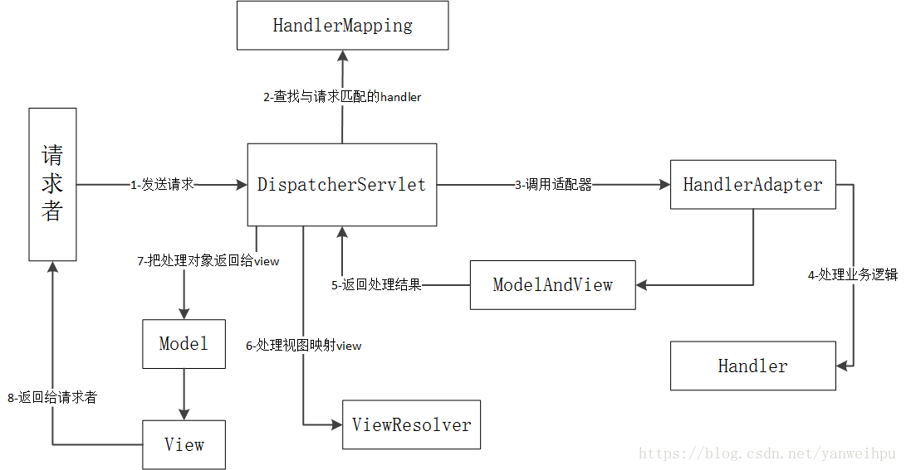

# Spring 学习

## Spring主要框架


核心容器：

- **spring-core**模块提供了框架的基本组成部分，包括 IoC 和依赖注入功能。
- **spring-beans** 模块提供 BeanFactory，工厂模式的微妙实现，它移除了编码式单例的需要，并且可以把配置和依赖从实际编码逻辑中解耦。
- **context**模块建立在由**core**和 **beans** 模块的基础上建立起来的，它以一种类似于JNDI注册的方式访问对象。Context模块继承自Bean模块，并且添加了国际化（比如，使用资源束）、事件传播、资源加载和透明地创建上下文（比如，通过Servelet容器）等功能。Context模块也支持Java EE的功能，比如EJB、JMX和远程调用等。**ApplicationContext**接口是Context模块的焦点。**spring-context-support**提供了对第三方库集成到Spring上下文的支持，比如缓存（EhCache, Guava, JCache）、邮件（JavaMail）、调度（CommonJ, Quartz）、模板引擎（FreeMarker, JasperReports, Velocity）等。
- **spring-expression**模块提供了强大的表达式语言，用于在运行时查询和操作对象图。它是JSP2.1规范中定义的统一表达式语言的扩展，支持set和get属性值、属性赋值、方法调用、访问数组集合及索引的内容、逻辑算术运算、命名变量、通过名字从Spring IoC容器检索对象，还支持列表的投影、选择以及聚合等。

## Spring 容器启动过程

- 1、资源定位：找到配置文件（载入配置文件/Springboot采用自动扫描）

- 2、BeanDefinition载入和解析（解析成BeanDefiniton）

- 3、BeanDefinition注册（添加到map(key,Definition)）

- 4、bean的实例化和依赖注入(getBean()方法进行实例化)

  实例化的时间点：

  BeanFactory作为工厂类：在第一次使用的时候实例化

  applicationContext作为容器：如果为singleton，则在容器启动的时候初始化bean并将bean放在缓存（单例池）中

  如果为singleton，并且设置lazy-init(延迟加载)为true，则在第一次使用的时候实例化bean

  如果为prototype

## Spring 主要功能

## IOC

**IOC**: 控制反转
即控制权的转移，将我们创建对象的方式反转了,以前对象的创建是由我们开发人员自己维护,包括依赖关系也是自己注入。使用了spring之后，对象的创建以及依赖关系可以由spring完成创建以及注入，反转控制就是反转了对象的创建方式，从我们自己创建反转给了程序创建(spring)

**DI**:  Dependency Injection  依赖注入
spring这个容器中，替你管理着一系列的类，前提是你需要将这些类交给spring容器进行管理，然后在你需要的时候，不是自己去定义，而是直接向spring容器索取，当spring容器知道你的需求之后，就会去它所管理的组件中进行查找，然后直接给你所需要的组件.
实现IOC思想需要DI做支持。
注入方式:   1.set方式注入    2.构造方法注入   3.字段注入
注入类型:   1.值类型注入      2.引用类型注入

**IOC 容器**

具有依赖注入功能的容器，它可以创建对象，IOC 容器负责实例化、定位、配置应用程序中的对象及建立这些对象间的依赖。是Spring框架的核心。Spring提供了两种不同的容器：Spring BeanFactory 容器（它是最简单的容器，给 DI 提供了基本的支持）和Spring ApplicationContext 容器（该容器添加了更多的企业特定的功能，例如从一个属性文件中解析文本信息的能力，发布应用程序事件给感兴趣的事件监听器的能力。）。

**对象的创建时间**：正常在容器初始化的时候进行创建，设置了lazy-init时，在getbean的时候进行创建。

#### Spring BeanFactory 容器

```java
//在Bean中配置bean的内容
public class MainApp {
   public static void main(String[] args) {
      XmlBeanFactory factory = new XmlBeanFactory
                             (new ClassPathResource("Beans.xml"));
       //使用ClassPathResource去读取XML文件，再调用XmlBeanFactory去生成BeanFactory
      HelloWorld obj = (HelloWorld) factory.getBean("helloWorld");//获取bean对象
      obj.getMessage();
   }
}
```

Application Context 是 BeanFactory 的子接口，也被成为 Spring 上下文。

Application Context 是 spring 中较高级的容器。ApplicationContext 包含 BeanFactory 所有的功能。

- **FileSystemXmlApplicationContext**：该容器从 XML 文件中加载已被定义的 bean。在这里，你需要提供给构造器 XML 文件的完整路径。
- **ClassPathXmlApplicationContext**：该容器从 XML 文件中加载已被定义的 bean。在这里，你不需要提供 XML 文件的完整路径，只需正确配置 CLASSPATH 环境变量即可，因为，容器会从 CLASSPATH 中搜索 bean 配置文件。
- **WebXmlApplicationContext**：该容器会在一个 web 应用程序的范围内加载在 XML 文件中已被定义的 bean。

```java
/**
第一步生成工厂对象。加载完指定路径下 bean 配置文件后，利用框架提供的 FileSystemXmlApplicationContext API 去生成工厂 bean。FileSystemXmlApplicationContext 负责生成和初始化所有的对象，比如，所有在 XML bean 配置文件中的 bean。

第二步利用第一步生成的上下文中的 getBean() 方法得到所需要的 bean。 这个方法通过配置文件中的 bean ID 来返回一个真正的对象。一旦得到这个对象，就可以利用这个对象来调用任何方法。
*/
public class MainApp {
   public static void main(String[] args) {
      ApplicationContext context = new FileSystemXmlApplicationContext
            ("Beans.xml");
      HelloWorld obj = (HelloWorld) context.getBean("helloWorld");
      obj.getMessage();
   }
}
```

#### Spring 配置元数据

配置元数据：bean 定义包含称为**配置元数据**的信息，下述容器也需要知道配置元数据：

- 如何创建一个 bean
- bean 的生命周期的详细信息
- bean 的依赖关系

提供配置元数据给Spring的方法：

- 基于 XML 的配置文件
- 基于注解的配置
- 基于 Java 的配置

#### **Spring bean作用域：**

singleton(容器中只有一个实例存在，单例模式实现)，prototype(每次都返回一个新的实例)，request(每次Http请求创建新的bean)，session(同一个HTTP Session共享一个Bean，不同Session使用不同的Bean),global-session(global session作用域类似于标准的HTTP Session作用域，不过它仅仅在基于portlet的web应用中才有意义。)，默认为singleton，可采用@Scope注解或者xml里面的scope属性进行修改。

**Bean生命周期**

Bean的生命周期可以表达为：Bean的定义——Bean的初始化——Bean的使用——Bean的销毁


在bean初始化前后进行操作
第一种：通过@PostConstruct 和 @PreDestroy 方法 实现初始化和销毁bean之前进行的操作
第二种是：通过 在xml中定义init-method 和  destory-method方法
第三种是： 通过bean实现InitializingBean和 DisposableBean接口

Constructor > @PostConstruct > InitializingBean > init-method

**后置处理器**

BeanPostProcessor,实现postProcessBeforeInitialization和postProcessAfterInitialization方法来实现bean初始化之前和之后的逻辑。

#### beanFactory 和FactoryBean

beanFactory是Spring容器的一个组件，负责来构建Bean的一个工厂，而FactoryBean则表示，要创建的这个bean是一个工厂类，用来生产其他bean的。


#### 依赖注入方式

基于构造函数进行注入

```java
   <!-- Definition for textEditor bean -->
   <bean id="textEditor" class="com.tutorialspoint.TextEditor">
      <constructor-arg ref="spellChecker"/>
   </bean>

   <!-- Definition for spellChecker bean -->
   <bean id="spellChecker" class="com.tutorialspoint.SpellChecker">
   </bean>
```

也可以使用p-namespace注入

```java
<bean id="bar" class="x.y.Bar"/>
<bean id="baz" class="x.y.Baz"/>
<bean id="foo" class="x.y.Foo" c:bar-ref="bar" c:baz-ref="baz" c:email="foo@bar.com"/>
```

基于设值函数进行注入

```java
   <!-- Definition for textEditor bean -->
   <bean id="textEditor" class="com.tutorialspoint.TextEditor">
      <property name="spellChecker" ref="spellChecker"/>
   </bean>
//基于值注入
   <!-- Definition for spellChecker bean -->
   <bean id="spellChecker" class="com.tutorialspoint.SpellChecker">
   </bean>
```

也可以使用p-namespace注入

```java
   <bean id="john-classic" class="com.example.Person"
      p:name="John Doe"
      p:spouse-ref="jane"/>
   </bean>

   <bean name="jane" class="com.example.Person"
      p:name="John Doe"/>
   </bean>
```

#### Spring 中的事件处理

**ContextRefreshedEvent** ApplicationContext 被初始化或刷新时，该事件被发布。这也可以在 ConfigurableApplicationContext 接口中使用 refresh() 方法来发生。
**ContextStartedEvent**当使用 ConfigurableApplicationContext 接口中的 start() 方法启动 ApplicationContext 时，该事件被发布。你可以调查你的数据库，或者你可以在接受到这个事件后重启任何停止的应用程序。
**ContextStoppedEvent** 当使用 ConfigurableApplicationContext 接口中的 stop() 方法停止 ApplicationContext 时，发布这个事件。你可以在接受到这个事件后做必要的清理的工作
 **ContextClosedEvent** 当使用 ConfigurableApplicationContext 接口中的 close() 方法关闭 ApplicationContext 时，该事件被发布。一个已关闭的上下文到达生命周期末端；它不能被刷新或重启。
**RequestHandledEvent** 这是一个 web-specific 事件，告诉所有 bean HTTP 请求已经被服务。

通过 ApplicationEvent 类和 ApplicationListener 接口来提供在 ApplicationContext 中处理事件。

若Bean实现了ApplicationListener 接口，并注册了，则在对应事件发生时，会通知该bean，即该Bean会监听事件。

**自定义事件：**通过继承ApplicationEvent接口自定义事件，同时还需要实现ApplicationEventPublisherAware接口来触发自定义的事件。

## AOP

AOP 即 Aspect Oriented Program 面向切面编程，将相同逻辑的重复代码横向抽取出来，使用动态代理技术将这些重复代码织入到目标对象方法中，实现和原来一样的功能。

AspectJ是**语言级别**的AOP实现，扩展了Java语言，定义了AOP语法，能够在**编译期**提供横切代码的织入，所以它有**专门的编译器**用来生成遵守Java字节码规范的Class文件。

**相关术语：**

1、**Advice** 表示通知。是切面的具体实现方法：前置增强、后置增强、环绕增强、异常抛出增强、最终增强等类型
2、**切入点** 筛选出的连接点
3、**连接点** 允许进行通知的地方，方法的前后等
4、**切面** 切入点和通知的结合就是切面，在特定的切入点上实现特定的功能。
5、**目标对象** 就是要被通知的对象，也就是真正的业务逻辑
6、**AOP代理** AOP框架创建的对象，包含通知。
7、**织入** 把切面应用到目标对象上构建新的代理对象的过程

Spring提供了3种类型的AOP支持：

- 基于代理的经典SpringAOP
  
  - 需要实现接口，手动创建代理（目前已经不建议使用）
  
- 纯POJO切面
  
  - 使用XML配置，aop命名空间
  
  ```java
  <aop:config>
     <aop:aspect id="myAspect" ref="aBean">
        <aop:pointcut id="businessService"
           expression="execution(* com.xyz.myapp.service.*.*(..))"/>
        <!-- a before advice definition -->
        <aop:before pointcut-ref="businessService" 
           method="doRequiredTask"/>
        <!-- an after advice definition -->
        <aop:after pointcut-ref="businessService" 
           method="doRequiredTask"/>
        <!-- an after-returning advice definition -->
        <!--The doRequiredTask method must have parameter named retVal -->
        <aop:after-returning pointcut-ref="businessService"
           returning="retVal"
           method="doRequiredTask"/>
        <!-- an after-throwing advice definition -->
        <!--The doRequiredTask method must have parameter named ex -->
        <aop:after-throwing pointcut-ref="businessService"
           throwing="ex"
           method="doRequiredTask"/>
        <!-- an around advice definition -->
        <aop:around pointcut-ref="businessService" 
           method="doRequiredTask"/>
     ...
     </aop:aspect>
  </aop:config>
  <bean id="aBean" class="...">
  ...
  </bean>
  ```
  
- @AspectJ注解驱动的切面
  
  - 使用注解的方式，这是最简洁和最方便的！
  
  ```java
  //xml文件里开启对应的aspectj注解
  <aop:aspectj-autoproxy/>
  //切面逻辑
  @Aspect  
  public class SleepHelper {   
   
      public SleepHelper(){         
   
      }   
      
      @Pointcut("execution(* *.sleep())")   
      public void sleeppoint(){}   
   
   
      @Before("sleeppoint()")   
      public void beforeSleep(){   
   
          System.out.println("睡觉前要脱衣服!");   
   
      }   
   
        
      @AfterReturning("sleeppoint()")   
      public void afterSleep(){   
   
          System.out.println("睡醒了要穿衣服！");   
   
      }   
   
  }
  ```
  
  Spring只使用了aspectJ的注解，并不需要引入aspecJ的其他依赖。

#### 切点表达式

```
execution(<修饰符模式>? <返回类型模式> <方法名模式>(<参数模式>) <异常模式>?)
```

除了返回类型模式、方法名模式和参数模式外，其它项都是可选的。

修饰符模式指的是public、private、protected，异常模式指的是NullPointException等。

**通配符**

```
*`通配符，该通配符主要用于匹配单个单词，或者是以某个词为前缀或后缀的单词。
```

```
.. 通配符，该通配符表示0个或多个项，主要用于declaring-type-pattern和param-pattern中，如果用于declaring-type-pattern中，则表示匹配当前包及其子包，如果用于param-pattern中，则表示匹配0个或多个参数。
```

可以使用&&、||、!、三种运算符来组合切点表达式，表示与或非的关系。

## SpringMVC

### SpringMVC运行原理



流程说明：

（1）客户端（浏览器）发送请求，直接请求到DispatcherServlet（前端控制器）。

（2）DispatcherServlet根据请求信息调用HandlerMapping，解析请求对应的Handler。

（3）解析到对应的Handler后，开始由HandlerAdapter适配器处理。

（4）HandlerAdapter会根据Handler来调用真正的处理器开处理请求，并处理相应的业务逻辑。

（5）处理器处理完业务后，会返回一个ModelAndView对象，Model是返回的数据对象，View是个逻辑上的View。

（6）ViewResolver会根据逻辑View查找实际的View。

（7）DispaterServlet把返回的Model传给View。

（8）通过View返回给请求者（浏览器）

## 常用注解

*@Autowired Spring* 容器查找并注入一个bean对象 按类去匹配

@Required 注释应用于 bean 属性的 setter 方法

*@Qualifier* 指定注入一个bean对象 按名字去匹配

*@Resource*
(1)、@Resource后面没有任何内容，默认通过name属性去匹配bean，找不到再按type去匹配
(2)、指定了name或者type则根据指定的类型去匹配bean
(3)、指定了name和type则根据指定的name和type去匹配bean，任何一个不匹配都将报错

*@Configuration*  带有 @Configuration 的注解类表示这个类可以使用 Spring IoC 容器作为 bean 定义的来源

@import 注解允许从另一个配置类中加载 @Bean 定义。

*@Bean*  @Bean 注解告诉 Spring，一个 @Bean 的注解方法将返回一个对象，该对象应该被注册为在 Spring 应用程序上下文中的 bean。 

*@Scope*(“”)设置bean的作用域

*@Component/@Repository/@Service/@Controller*
Component 通用bean
Repository 对应数据访问层Bean
Service 对应业务逻辑层bean
Controller 对应表现层的Bean

@refrence与@resource 

@ComponentScan 启动组件扫描，默认扫描同一包下的组件

前者是dubbo注解，后者是spring 的。后者@resource很简单就是注入资源，与@Autowired比较接近，只不过是按照变量名（beanid）注入。@reference也是注入，但是一般用来注入分布式的远程服务对象，需要配合dubbo配置使用。他们的区别就是一个是本地spring容器，另一个是把远程服务对象当做spring容器中的对象一样注入。