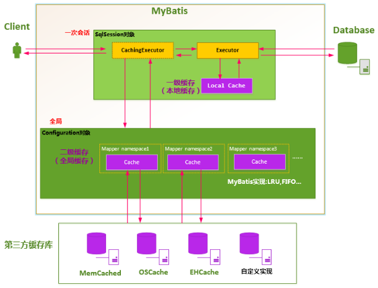

# Mybatis 学习

### JDBC工作流程

（1）  加载JDBC驱动

（2）  建立并获取数据库连接

（3）  创建 JDBC Statements 对象

（4）  设置SQL语句的传入参数

（5）  执行SQL语句并获得查询结果

（6）  对查询结果进行转换处理并将处理结果返回

（7）  释放相关资源（关闭Connection，关闭Statement，关闭ResultSet）

mybatis对JDBC的优化:

（1） 使用数据库连接池对连接进行管理

（2） SQL语句统一存放到配置文件

（3） SQL语句变量和传入参数的映射以及动态SQL

（4） 动态SQL语句的处理

（5） 对数据库操作结果的映射和结果缓存

（6） SQL语句的重复(SQL模块化)

Mybatis基本结构和流程

流程：

当框架启动时，通过configuration解析config.xml配置文件和mapper.xml映射文件，映射文件可以使用xml方式或者注解方式，然后由configuration获得sqlsessionfactory对象，再由sqlsessionfactory获得sqlsession数据库访问会话对象，通过会话对象获得对应DAO层的mapper对象，通过调用mapper对象相应方法，框架就会自动执行SQL语句从而获得结果。

## 配置文件
文档结构
+ configuration（配置）
    + properties（属性）
    + settings（设置）
    + typeAliases（类型别名）
    + typeHandlers（类型处理器）
    + objectFactory（对象工厂）
    + plugins（插件）
    + environments（环境配置）
        + environment（环境变量）
            + transactionManager（事务管理器）
            + dataSource（数据源）
    + databaseIdProvider（数据库厂商标识）
    + mappers（映射器）

### 1 Properties
这些属性都是可外部配置且可动态替换的，既可以在典型的 Java 属性文件中配置
```xml
<dataSource type="POOLED">
  <property name="driver" value="${driver}"/>
  <property name="url" value="${url}"/>
  <property name="username" value="${username}"/>
  <property name="password" value="${password}"/>
</dataSource>
```
### 2 Setting
这是 MyBatis 中极为重要的调整设置，它们会改变 MyBatis 的运行时行为。
```xml
<settings>
  <setting name="cacheEnabled" value="true"/>
  <setting name="lazyLoadingEnabled" value="true"/>
  <setting name="multipleResultSetsEnabled" value="true"/>
  <setting name="useColumnLabel" value="true"/>
  <setting name="useGeneratedKeys" value="false"/>
  <setting name="autoMappingBehavior" value="PARTIAL"/>
  <setting name="autoMappingUnknownColumnBehavior" value="WARNING"/>
  <setting name="defaultExecutorType" value="SIMPLE"/>
  <setting name="defaultStatementTimeout" value="25"/>
  <setting name="defaultFetchSize" value="100"/>
  <setting name="safeRowBoundsEnabled" value="false"/>
  <setting name="mapUnderscoreToCamelCase" value="false"/>
  <setting name="localCacheScope" value="SESSION"/>
  <setting name="jdbcTypeForNull" value="OTHER"/>
  <setting name="lazyLoadTriggerMethods" value="equals,clone,hashCode,toString"/>
</settings>
```
### 3 类型别名（typeAliases）
类型别名是为 Java 类型设置一个短的名字。 它只和 XML 配置有关，存在的意义仅在于用来减少类完全限定名的冗余。

### 4 类型处理器（typeHandlers）
无论是 MyBatis 在预处理语句（PreparedStatement）中设置一个参数时，还是从结果集中取出一个值时， 都会用类型处理器将获取的值以合适的方式转换成 Java 类型。

要注意 MyBatis 不会通过窥探数据库元信息来决定使用哪种类型，所以你必须在参数和结果映射中指明那是 VARCHAR 类型的字段， 以使其能够绑定到正确的类型处理器上。这是因为 MyBatis 直到语句被执行时才清楚数据类型

### 5 对象工厂（objectFactory）
MyBatis 每次创建结果对象的新实例时，它都会使用一个对象工厂（ObjectFactory）实例来完成。 默认的对象工厂需要做的仅仅是实例化目标类，要么通过默认构造方法，要么在参数映射存在的时候通过参数构造方法来实例化。 

### 6 插件（plugins）
MyBatis 允许你在已映射语句执行过程中的某一点进行拦截调用。默认情况下，MyBatis 允许使用插件来拦截的方法调用包括：
+ Executor (update, query, flushStatements, commit, rollback, getTransaction, close, isClosed)
+ ParameterHandler (getParameterObject, setParameters)
+ ResultSetHandler (handleResultSets, handleOutputParameters)
+ StatementHandler (prepare, parameterize, batch, update, query)

通过 MyBatis 提供的强大机制，使用插件是非常简单的，只需实现 Interceptor 接口，并指定想要拦截的方法签名即可。

### 7 环境配置（environments）
MyBatis 可以配置成适应多种环境，这种机制有助于将 SQL 映射应用于多种数据库之中，不过要记住：尽管可以配置多个环境，但每个 SqlSessionFactory 实例只能选择一种环境。所以，如果你想连接两个数据库，就需要创建两个 SqlSessionFactory 实例，每个数据库对应一个。而如果是三个数据库，就需要三个实例。
```xml
<environments default="development">
  <environment id="development">
    <transactionManager type="JDBC">
      <property name="..." value="..."/>
    </transactionManager>
    <dataSource type="POOLED">
      <property name="driver" value="${driver}"/>
      <property name="url" value="${url}"/>
      <property name="username" value="${username}"/>
      <property name="password" value="${password}"/>
    </dataSource>
  </environment>
</environments>
```
**事务管理器（transactionManager）**
JDBC – 这个配置就是直接使用了 JDBC 的提交和回滚设置，它依赖于从数据源得到的连接来管理事务作用域。

MANAGED – 这个配置几乎没做什么。它从来不提交或回滚一个连接，而是让容器来管理事务的整个生命周期（比如 JEE 应用服务器的上下文）。 默认情况下它会关闭连接，然而一些容器并不希望这样，因此需要将 closeConnection 属性设置为 false 来阻止它默认的关闭行为。

**数据源（dataSource）**
```xml
<dataSource type="org.myproject.C3P0DataSourceFactory">
  <property name="driver" value="org.postgresql.Driver"/>
  <property name="url" value="jdbc:postgresql:mydb"/>
  <property name="username" value="postgres"/>
  <property name="password" value="root"/>
</dataSource>
```
### 8 数据库厂商标识（databaseIdProvider）
MyBatis 可以根据不同的数据库厂商执行不同的语句，这种多厂商的支持是基于映射语句中的 databaseId 属性。
### 9 映射器（mappers）
既然 MyBatis 的行为已经由上述元素配置完了，我们现在就要定义 SQL 映射语句了。 但是首先我们需要告诉 MyBatis 到哪里去找到这些语句。

## MyBatis-Spring
MyBatis-Spring 会帮助你将 MyBatis 代码无缝地整合到 Spring 中。它将允许 MyBatis 参与到 Spring 的事务管理之中，创建映射器 mapper 和 SqlSession 并注入到 bean 中，以及将 Mybatis 的异常转换为 Spring 的 DataAccessException。最终，可以做到应用代码不依赖于 MyBatis，Spring 或 MyBatis-Spring。

要和 Spring 一起使用 MyBatis，需要在 Spring 应用上下文中定义至少两样东西：一个 SqlSessionFactory 和至少一个数据映射器类。

在 MyBatis-Spring 中，可使用 SqlSessionFactoryBean来创建 SqlSessionFactory。 要配置这个工厂 bean，只需要把下面代码放在 Spring 的 XML 配置文件中：
```xml
<bean id="sqlSessionFactory" class="org.mybatis.spring.SqlSessionFactoryBean">
  <property name="dataSource" ref="dataSource" />
</bean>
```
注意：SqlSessionFactory 需要一个 DataSource（数据源）。 这可以是任意的 DataSource，只需要和配置其它 Spring 数据库连接一样配置它就可以了。

然后就可以使用sqlsession进行事务管理


# mybatis学习

依赖
```xml
<!-- Mybatis springboot -->
<dependency>
    <groupId>org.mybatis.spring.boot</groupId>
    <artifactId>mybatis-spring-boot-starter</artifactId>
</dependency>
<!-- druid阿里巴巴数据库连接池 -->
<dependency>
    <groupId>com.alibaba</groupId>
    <artifactId>druid</artifactId>
</dependency>
<!-- MySql数据库驱动 -->
<dependency>
    <groupId> mysql</groupId>
    <artifactId> mysql-connector-java</artifactId>
</dependency>
```

mybatis组件功能配置（如开启各种功能，mapper文件位置等），使用xml，configure或者 properties

定义实体类对应数据库中的表结构

创建Dao接口，加上注解@mapper

创建对应接口的mapper.xml文件（用xml对接口进行实现，采用sql语句）

### 一些思考（个人向）

关于sqlsession和jdbc的连接的关系，sqlsession是mybatis框架的一个对象，负责处理上层交付下来的sql，在若需要操作数据库，则会建立jdbc连接，操作数据库，若使用的是连接池，则会根据连接池的规则去使用和创建连接。

关于缓存的问题，mybatis的缓存由框架控制，下一部分会介绍，关于数据库部分自身的缓存则有数据库自身进行管理。

## mybatis 缓存

缓存架构



分为一级缓存和二级缓存

一级缓存为sqlsession的缓存，缓存只针对查询语句，一级缓存生命周期只存在于一个sqlsession对象。事务提交，插入更新和删除操作会自动更新缓存。也可以手动刷新缓存，关闭sqlsession会释放缓存。

二级缓存，默认不开启，需要手动设置开启，需要返回的pojo是可以序列化的，即实现了serializable接口的，二级缓存不同namespace是分开的，相同的namespace的对象是共享缓存的。二级缓存只有关闭sqlsession才会写入（实际存储在硬盘）性能问题？。


