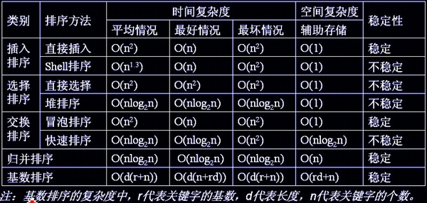

# 算法

## 排序算法

shell排序思想：用步长分成不同的组进行插入排序

快排思想，设立划分区间，然后进行分治

冒泡：逐个交换

归并：分组然后合并排序

基数排序：对不同关键字依次进行排序

堆排序：建立大根堆，然后交换堆顶和堆低，调整堆，重复。

不稳定：快希选一堆（快些选一堆）

## 动态规划

可以采用动态规划解决的问题：

+ 具有最有子结构性质，即最优解包含的子问题的解也是最优解
+ 无后效性，当前状态不受之后的影响
+ 重叠子问题，子问题的解在下一阶段的决策会用到

