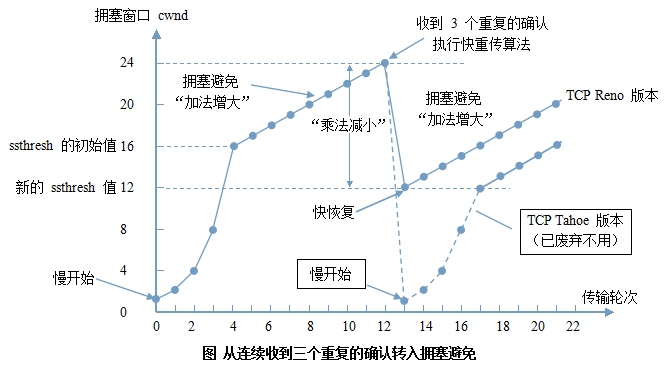

# 计算机网络相关知识

### 五层模型及对应的协议：

应用层：http.SMTP 数据单元 报文

传输层：tcp，udp

网络层：IP，相关的路由协议

数据链路层：PPP and 以太网

物理层：相关的物理协议

### TCP连接建立与断开

过程图：

TCP建立的三次握手：

　　1、发送端发送一个SYN报文段（SYN位被置位），SYN中包含TCP目的端口和发送端的初始序列号（图中ISN(c)），同时携带着TCP选项数据。

　　2、接收端收到发送端连接请求后，接收端发送自己SYN报文段（包含ISN(s)），同时对发送端的SYN进行确认，如前所述，接收端发送的ACK是ISN(c)+1。此时ACK位与SYN位都被置位。接收端发送SYN+ACK到发送端。

　　3、发送端接收到接收端的SYN+ACK数据后，对ISN(s)进行确认，发送ACK为ISN(s)+1的报文段给接收端。

TCP断开的四次握手：

　　1、TCP协议规定通过发送一个FIN段（FIN被置位）来发起关闭操作，图3中发送端发送FIN段给接收端，告知它数据已发送完毕，请求断开TCP连接。同时FIN报文段还包含着对最近收到的数据进行ACK。

　　2、接收端接收端FIN报文段后，对FIN进行确认，发送ACK=k+1给发送端。

　　3、接收端将连接关闭发送给上层应用程序，由应用程序发起连接关闭操作。此时接收端由被动关闭连接壮成主动，并发送FIN报文段给发送端。报文的序列号为L（这里也可看出上一步骤中发送ACK序列号也为L，因为ACK不占用序列号，所以这里的FIN的序列号也为L）。

　　4、发送端接收到FIN后，发送回ACK给接收端后，TCP连接终止。如果FIN丢失，发送FIN的那端需要重新发送FIN，知道接收到ACK为止。

### 为什么要三次握手四次挥手

#### 三次握手：

第一次，接收方确认自己的收消息没问题，第二次，发送发确认自己的发送消息和接受消息通路没有问题，第三次，接收方确认自己的发送通路没有问题。

状态的变化：客户端发送第一次消息时，进入到准备发送阶段，服务端接收到第一条消息后进入到准备接受阶段，并发送第二条消息，客户端接收到第二条消息后，正式建立连接，并发送确认消息，服务端接收到确认消息后，也正式建立连接，此时通道建立完成。

### 滑动窗口和流量控制

为了进行拥塞控制，TCP 发送方要维持一个 **拥塞窗口(cwnd)** 的状态变量。拥塞控制窗口的大小取决于网络的拥塞程度，并且动态变化。发送方让自己的发送窗口取为拥塞窗口和接收方的接受窗口中较小的一个。

TCP的拥塞控制采用了四种算法，即 **慢开始** 、 **拥塞避免** 、**快重传** 和 **快恢复**。在网络层也可以使路由器采用适当的分组丢弃策略（如主动队列管理 AQM），以减少网络拥塞的发生。

- **慢开始：** 慢开始算法的思路是当主机开始发送数据时，如果立即把大量数据字节注入到网络，那么可能会引起网络阻塞，因为现在还不知道网络的符合情况。经验表明，较好的方法是先探测一下，即由小到大逐渐增大发送窗口，也就是由小到大逐渐增大拥塞窗口数值。cwnd初始值为1，每经过一个传播轮次，cwnd加倍。
- **拥塞避免：** 拥塞避免算法的思路是让拥塞窗口cwnd缓慢增大，即每经过一个往返时间RTT就把发送放的cwnd加1.
- **快重传与快恢复：** 在 TCP/IP 中，快速重传和恢复（fast retransmit and recovery，FRR）是一种拥塞控制算法，它能快速恢复丢失的数据包。没有 FRR，如果数据包丢失了，TCP 将会使用定时器来要求传输暂停。在暂停的这段时间内，没有新的或复制的数据包被发送。有了 FRR，如果接收机接收到一个不按顺序的数据段，它会立即给发送机发送一个重复确认。如果发送机接收到三个重复确认，它会假定确认件指出的数据段丢失了，并立即重传这些丢失的数据段。有了 FRR，就不会因为重传时要求的暂停被耽误。 　当有单独的数据包丢失时，快速重传和恢复（FRR）能最有效地工作。当有多个数据信息包在某一段很短的时间内丢失时，它则不能很有效地工作。

拥塞控制示意图：

### CDN

普通访问：

①用户在自己的浏览器中输入要访问的网站域名。

②浏览器向本地DNS服务器请求对该域名的解析。

③本地DNS服务器中如果缓存有这个域名的解析结果，则直接响应用户的解析请求。

④本地DNS服务器中如果没有关于这个域名的解析结果的缓存，则以递归方式向整个DNS系统请求解析，获得应答后将结果反馈给浏览器。

⑤浏览器得到域名解析结果，就是该域名相应的服务设备的IP地址。

⑥浏览器向服务器请求内容。

⑦服务器将用户请求内容传送给浏览器。

使用CDN的访问过程

①当用户点击网站页面上的内容URL，经过本地DNS系统解析，DNS系统会最终将域名的解析权交给CNAME指向的CDN专用DNS服务器。

②CDN的DNS服务器将CDN的全局负载均衡设备IP地址返回用户。

③用户向CDN的全局负载均衡设备发起内容URL访问请求。

④CDN全局负载均衡设备根据用户IP地址，以及用户请求的内容URL，选择一台用户所属区域的区域负载均衡设备，告诉用户向这台设备发起请求。

⑤区域负载均衡设备会为用户选择一台合适的缓存服务器提供服务，选择的依据包括：根据用户IP地址，判断哪一台服务器距用户最近；根据用户所请求的URL中携带的内容名称，判断哪一台服务器上有用户所需内容；查询各个服务器当前的负载情况，判断哪一台服务器尚有服务能力。基于以上这些条件的综合分析之后，区域负载均衡设备会向全局负载均衡设备返回一台缓存服务器的IP地址。

⑥全局负载均衡设备把服务器的IP地址返回给用户。

⑦用户向缓存服务器发起请求，缓存服务器响应用户请求，将用户所需内容传送到用户终端。如果这台缓存服务器上并没有用户想要的内容，而区域均衡设备依然将它分配给了用户，那么这台服务器就要向它的上一级缓存服务器请求内容，直至追溯到网站的源服务器将内容拉到本地。

　　DNS服务器根据用户IP地址，将域名解析成相应节点的缓存服务器IP地址，实现用户就近访问。使用CDN服务的网站，只需将其域名解析权交给CDN的GSLB设备，将需要分发的内容注入CDN，就可以实现内容加速了。